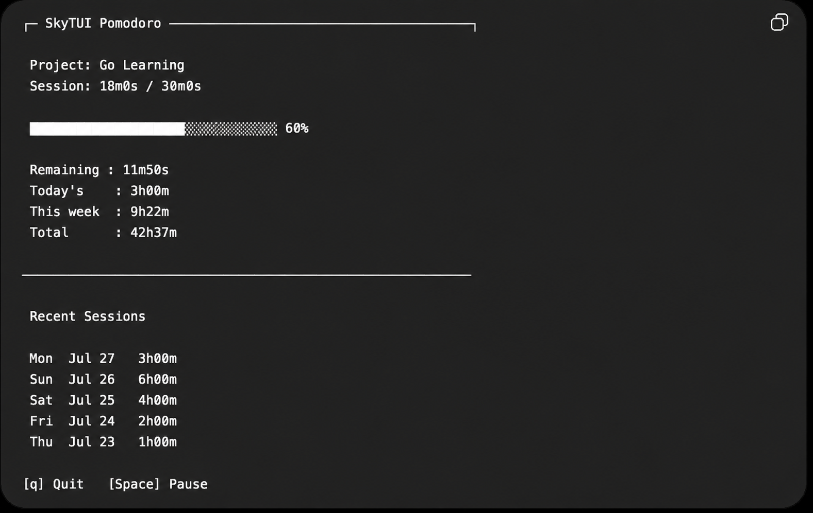

# SkyTUI Plan

`[x]` is complete. `[ ]` is planned. Future tasks can be adjusted before work
starts, but the current task should stay focused.

## Design Reference

This image is the direction for the completed dashboard, not the current
released interface.



## v0.1.0 - Usable Timer

Goal: ship a reliable local Pomodoro timer that can be installed and used from
the terminal.

### [x] 1. Display A Static Pomodoro Screen

Create the initial SkyTUI application:

- Cobra provides the root `skytui` command and `--help` output.
- Running `skytui` launches a Bubble Tea screen.
- The screen shows the `SkyTUI Pomodoro` title, `Session: 0 / 25 min`, an empty
  Bubbles progress bar at `0%`, `Remaining: 25m00s`, and `[q] Quit`.
- A Lip Gloss normal border with padding wraps the timer content; `[q] Quit`
  appears below the border.
- `q` closes the application.

#### Commit

```text
feat: display a static pomodoro screen
```

### [x] 2. Write Application Logs To A File

Add minimal file logging with the standard library's `log/slog` package:

- Use the existing macOS `~/Library/Logs` directory as the parent location.
- Create `~/Library/Logs/skytui` with `0700` permissions so only the current
  user can access SkyTUI's log directory.
- Create `~/Library/Logs/skytui/skytui.log` when it does not exist, then open
  it in append mode with `0600` permissions so only the current user can read
  or write it.
- Configure a `slog.TextHandler` as the default logger before the TUI starts.
- Log when SkyTUI starts and when the user quits with `q`.
- Close the log file after Cobra and Bubble Tea finish.
- Do not add rotation, configurable levels, Viper, or another logging library
  yet.

#### Commit

```text
chore: add file logging
```

### [x] 3. Add The Pomodoro Countdown

Make the 25-minute timer run automatically when SkyTUI opens:

- Update the session time, progress bar, percentage, and remaining time every
  second.
- Stop at `25 / 25 min`, `100%`, and `Remaining: 0s`.
- Keep the completed screen visible until the user presses `q`.
- Log countdown start and completion events at `INFO` level.

#### Commit

```text
feat: add pomodoro countdown
```

### [x] 4. Pause And Resume The Countdown

Let the user control an active Pomodoro with `space`:

- While running, pressing `space` pauses the countdown and changes the footer
  control to `[Space] Resume`.
- While paused, session time, progress, and remaining time stay unchanged.
- Pressing `space` again resumes from the same point and changes the footer
  control back to `[Space] Pause`.
- After completion, `space` has no effect.
- Log pause and resume events at `INFO` level.

#### Commit

```text
feat: pause and resume pomodoro countdown
```

### [x] 5. Configure The Pomodoro Duration

- Add a Cobra `--duration` flag with a `25m` default.
- Use the selected duration for timer state, progress, and display values.
- Reject invalid durations, values below one second, and fractional seconds
  before opening the TUI.

**Commit:** `feat: configure pomodoro duration`

### [x] 6. Keep The Countdown Accurate

- Derive running time from timestamps instead of the number of received tick
  messages.
- Keep remaining time correct when rendering is delayed.
- Freeze elapsed time while paused and continue correctly after resume.

**Commit:** `fix: prevent pomodoro timer drift`

### [x] 7. Test The Timer States

- Cover running ticks, pause, resume, reaching the deadline, and controls after completion.
- Test state transitions by sending messages without waiting on real time.

**Commit:** `test: cover pomodoro timer states`

### [x] 8. Prepare v0.1.0

- Document installation, usage, duration flag, controls, and log location.
- Add `--version` output for `v0.1.0`.
- State that `v0.1.0` supports macOS.
- Add the MIT license and an image of the released interface.
- Document release binaries for Apple Silicon and Intel Macs.
- Verify a clean install and one complete short manual session.

**Commit:** `chore: prepare v0.1.0`

**Tag:** `v0.1.0`

## Release Maintenance

### [x] 9. Generate Release Checksums With Make

- Add a `Makefile` with a `checksums` target.
- Accept the release version so the target can be reused for later releases.
- Generate `checksums.txt` for the Apple Silicon and Intel archives in the
  matching `dist` release directory.

**Commit:** `build: add release checksum target`

## v0.2.0 - Session History

Goal: make completed focus time useful after the timer exits.

### [x] 10. Separate The Pomodoro Model From Cobra

- Create `internal/pomodoro` for the Bubble Tea application.
- Move the model fields, timer statuses, tick message, `Init`, `Update`, and
  `View` from `cmd/root.go` into the new package.
- Make the model own its duration, remaining time, deadline, pause state, and
  Bubbles progress model.
- Provide a constructor that receives the session duration and returns a fully
  initialized Bubble Tea model.
- Keep `cmd/root.go` responsible only for Cobra flags, duration validation,
  help/version output, and starting `tea.NewProgram`.
- Move the timer-state tests with the model and keep every current behavior
  unchanged.

**Commit:** `refactor: separate pomodoro model from command`

### [x] 11. Store Completed Sessions

- Create `~/Library/Application Support/skytui` with `0700` permissions.
- Append completed session time and duration to `sessions.csv` with `0600`
  permissions.
- Save a completed session exactly once; do not save partial sessions yet.

**Commit:** `feat: persist completed pomodoro sessions`

### [x] 12. Show Recent Sessions

- Load saved sessions when SkyTUI starts.
- Show the five most recent completed sessions below the timer.
- Refresh the recent sessions after a session completes.
- Treat a missing or empty session file as an empty history.

**Commit:** `feat: show recent pomodoro sessions`

### [x] 13. Show Focus Totals

- Display today's, the current week's, the current month's, and all-time completed focus durations.
- Refresh the values after a session completes.

**Commit:** `feat: show focus time totals`

### [x] 14. Test Session Data

- Test CSV append and load behavior using temporary directories.
- Test recent-session ordering and total calculations around day and ISO-week
  boundaries.

**Commit:** `test: cover session storage and summaries`

### [x] 15. Prepare v0.2.0

- Document the session file and dashboard history.
- Add an updated screenshot.
- Verify fresh startup and startup with existing session data.

**Commit:** `chore: prepare v0.2.0`

**Tag:** `v0.2.0`

## v0.3.0 - Defaults And Polish

Goal: make repeated daily use configurable and resilient.

### [x] 16. Load Persistent Defaults

- Use Viper with `~/Library/Application Support/skytui/config.yaml`.
- Persist a default Pomodoro duration.
- Let the Cobra `--duration` flag override the configured value.

**Commit:** `feat: load pomodoro defaults from config`

### [x] 17. Reset The Timer

- Reset the active or paused timer with `r`.
- Return session time, remaining time, and progress to their initial values.
- Do not save the discarded session.

**Commit:** `feat: reset pomodoro countdown`

### [x] 18. Make The Dashboard Responsive

- Respond to terminal resize messages.
- Keep the timer, progress bar, history, totals, and controls readable at
  80x24 and wider terminal sizes.

**Commit:** `feat: make pomodoro dashboard responsive`

### [x] 19. Prepare v0.3.0

- Document configuration precedence and reset behavior.
- Verify configuration, resize, timer, and history workflows together.

**Commit:** `chore: prepare v0.3.0`

**Tag:** `v0.3.0`

## v0.4.0 - Work And Break Cycle

Goal: alternate between focused work and short breaks without automatically
starting the next session.

### [x] 20. Configure Short Break Duration

- Add `short-break-duration: 5m0s` to `config.yaml`.
- Load and validate the break duration with the existing Pomodoro default.
- Keep `--duration` scoped to focus sessions.

**Commit:** `feat: configure short break duration`

### [ ] 21. Add Focus And Break Session Types

- Represent the active session as either focus or short break.
- Start SkyTUI with a focus session.
- Show the active session type on the dashboard.
- Persist and total completed focus sessions only.

**Commit:** `feat: add focus and break session types`

### [ ] 22. Cycle Between Focus And Break Sessions

- After a focus session completes, show `[n] Next` to start a short break.
- After a short break completes, show `[n] Next` to start a focus session.
- Do not start the next session automatically.
- Keep pause and reset behavior available during both session types.

**Commit:** `feat: cycle between focus and break sessions`

### [ ] 23. Test The Session Cycle

- Test focus-to-break and break-to-focus transitions.
- Test that completed breaks are not persisted or included in focus totals.
- Test pause and reset behavior during short breaks.

**Commit:** `test: cover focus and break cycles`

### [ ] 24. Prepare v0.4.0

- Document short-break configuration, session types, and next-session controls.
- Verify focus, break, reset, persistence, history, and configuration workflows
  together.

**Commit:** `chore: prepare v0.4.0`

**Tag:** `v0.4.0`

## Later - Not Planned Yet

- Long breaks and automatic session starts.
- Completion notifications.
- A full history screen with editing and filtering.
- Cross-platform data, configuration, and log paths.
- Import and sync.

Plan these only after using the released dashboard enough to identify the next
real problem.
