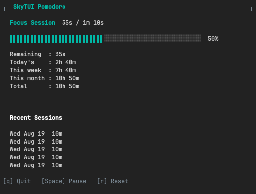

# SkyTUI

SkyTUI is a terminal Pomodoro timer for running focused work sessions and tracking completed focus time.
The Pomodoro Technique organizes work into timed focus intervals, commonly 25 minutes, separated by short breaks.



## Installation

SkyTUI v0.5.0 supports macOS.

### Download a binary

Download the appropriate archive from the
[GitHub release](https://github.com/fmo/skytui/releases/tag/v0.5.0):

- [Apple Silicon (`arm64`)](https://github.com/fmo/skytui/releases/download/v0.5.0/skytui_0.5.0_darwin_arm64.tar.gz)
- [Intel Mac (`amd64`)](https://github.com/fmo/skytui/releases/download/v0.5.0/skytui_0.5.0_darwin_amd64.tar.gz)
- [SHA-256 checksums](https://github.com/fmo/skytui/releases/download/v0.5.0/checksums.txt)

Extract the archive and move the `skytui` executable to a directory in your `PATH`, such as `/usr/local/bin`.

### Verify the download

Download `checksums.txt` into the same directory as the archive, then run the command matching your Mac.

Apple Silicon:

```sh
grep darwin_arm64 checksums.txt | shasum -a 256 -c -
```

Intel Mac:

```sh
grep darwin_amd64 checksums.txt | shasum -a 256 -c -
```

A valid download reports OK.

### Install with Go

Requires Go 1.25.3 or later.

```sh
go install github.com/fmo/skytui@v0.5.0
```

## Usage

Start a 25-minute Pomodoro session:

```sh
skytui
```

Start a session with a custom duration:

```sh
skytui --duration 10m
```

The duration must be at least one second and use whole-second precision.
Examples include `30s`, `10m`, and `1h`.

SkyTUI starts with a focus session. After it completes, press `n` to start a
short break. Press `n` again after the break completes to start the next focus
session. The next session never starts automatically.

Show installed version:

```sh
skytui --version
```

Show available options:

```sh
skytui --help
```

## Controls

- `Space` pauses or resumes the session.
- `r` resets a running or paused session to its full duration. Running sessions
  continue immediately; paused sessions remain paused.
- `n` starts the next focus or short-break session after completion.
- `q` quits SkyTUI.

## Configuration

SkyTUI creates its configuration file on first run:

```text
~/Library/Application Support/skytui/config.yaml
```

The default configuration is:

```yaml
default-duration: 25m0s
short-break-duration: 5m0s
```

SkyTUI uses `default-duration` from `config.yaml`, falling back to 25 minutes
when the setting is absent. The `--duration` flag overrides the configured
focus duration for the current run. Short breaks default to five minutes.

Configured durations follow the same rules as `--duration`: they must be at
least one second and use whole-second precision.

## Session History

SkyTUI saves completed sessions to:

```text
~/Library/Application Support/skytui/sessions.csv
```

The dashboard shows the five most recently completed focus sessions, with the
newest session first. Each entry includes its completion date and duration.
Partial focus sessions and short breaks are not saved or included in totals.

## Logs

SkyTUI writes application logs to:

```text
~/Library/Logs/skytui/skytui.log
```
