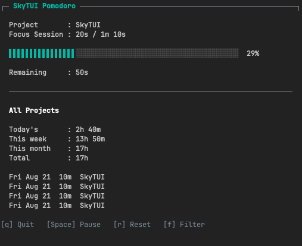

# SkyTUI

SkyTUI is a terminal Pomodoro timer for running focused work sessions, organizing
them by project, and tracking completed focus time.
The Pomodoro Technique organizes work into timed focus intervals, commonly 25 minutes, separated by short breaks.



## Installation

SkyTUI v0.8.0 supports macOS.

### Download a binary

Download the appropriate archive from the
[GitHub release](https://github.com/fmo/skytui/releases/tag/v0.8.0):

- [Apple Silicon (`arm64`)](https://github.com/fmo/skytui/releases/download/v0.8.0/skytui_0.8.0_darwin_arm64.tar.gz)
- [Intel Mac (`amd64`)](https://github.com/fmo/skytui/releases/download/v0.8.0/skytui_0.8.0_darwin_amd64.tar.gz)
- [SHA-256 checksums](https://github.com/fmo/skytui/releases/download/v0.8.0/checksums.txt)

Extract the archive and move the `skytui` executable to a directory in your `PATH`, such as `/usr/local/bin`.

### Verify the download

Download `checksums.txt` into the same directory as the archive, then run the command matching your Mac.

Apple Silicon:

```sh
grep darwin_arm64 checksums.txt | shasum -a 256 -c -
```

Intel Mac:

```sh
grep darwin_amd64 checksums.txt | shasum -a 256 -c -
```

A valid download reports OK.

### Install with Go

Requires Go 1.25.3 or later.

```sh
go install github.com/fmo/skytui@v0.8.0
```

## Usage

Start a 25-minute Pomodoro session:

```sh
skytui
```

Start a session with a custom duration:

```sh
skytui --duration 10m
```

The duration must be at least one second and use whole-second precision.
Examples include `30s`, `10m`, and `1h`.

SkyTUI opens the project picker before starting a focus session. Select a
project with the arrow keys or `j`/`k`, then press `Enter`. Press `n` to create
a project when the list is empty or when you need another one. SkyTUI remembers
the last selection and preselects it on the next launch.

After a focus session completes, press `n` to start a short break. Press `n`
again after the break completes to start the next focus session. The next
session never starts automatically.

Press `f` from the dashboard to filter totals and recent sessions by all
projects, one project, or unassigned legacy sessions. Applying a filter does
not affect the active timer.

Show installed version:

```sh
skytui --version
```

Show available options:

```sh
skytui --help
```

## Controls

- `Up`/`Down` or `k`/`j` moves through project and history-filter options.
- `Enter` selects or creates a project, or applies the highlighted history
  filter.
- `n` opens project creation from the picker.
- `Esc` cancels project creation.
- `f` opens the history filter from the dashboard.
- `Space` pauses or resumes the session.
- `r` resets a running or paused session to its full duration. Running sessions
  continue immediately; paused sessions remain paused.
- `n` starts the next focus or short-break session after completion.
- `q` quits SkyTUI.

## Configuration

SkyTUI creates its configuration file on first run:

```text
~/Library/Application Support/skytui/config.yaml
```

The default configuration is:

```yaml
default-duration: 25m0s
short-break-duration: 5m0s
active-project-id: ""
notifications-enabled: true
```

SkyTUI uses `default-duration` from `config.yaml`, falling back to 25 minutes
when the setting is absent. The `--duration` flag overrides the configured
focus duration for the current run. Short breaks default to five minutes.

Configured durations follow the same rules as `--duration`: they must be at
least one second and use whole-second precision.

`active-project-id` stores the last selected project. SkyTUI manages this value
when a project is selected.

## Notifications

SkyTUI sends a macOS desktop notification when a focus or short-break session
completes. The notification identifies the completed session and the session
available next. It does not start the next session; press `n` when you are
ready to continue.

Set `notifications-enabled` to `false` in `config.yaml` to disable desktop
notifications. Missing notification settings default to enabled. Delivery
failures are written to the application log without stopping the timer.

## Projects

SkyTUI stores projects separately from session history:

```text
~/Library/Application Support/skytui/projects.csv
```

Project names must be non-empty and unique regardless of letter case. Each
project receives a stable internal ID that associates it with completed focus
sessions. Short breaks are not associated with a project.

The active project determines which project receives completed focus sessions.
The history filter only changes the totals and recent sessions shown on the
dashboard; it does not pause, reset, or reassign the current session. The
filter defaults to `All Projects` whenever SkyTUI starts and remains selected
while the application is open.

## Session History

SkyTUI saves completed sessions to:

```text
~/Library/Application Support/skytui/sessions.csv
```

The dashboard shows the four most recently completed focus sessions, with the
newest session first. Each entry includes its completion date, duration, and
project name. Partial focus sessions and short breaks are not saved or included
in totals.

Sessions created before `v0.6.0` remain supported. Their existing two-field CSV
rows are loaded as unassigned sessions and are not rewritten. New focus sessions
include their project ID as a third field.

## Logs

SkyTUI writes application logs to:

```text
~/Library/Logs/skytui/skytui.log
```
